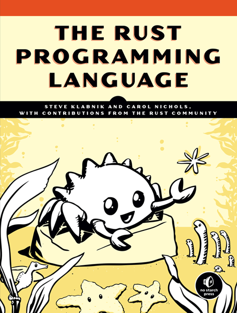

# rust_book

ref: https://github.com/rust-lang/book

ref: https://doc.rust-lang.org/book/2018-edition/

new url for stable / current edition

https://doc.rust-lang.org/stable/book/

## nostarch print version

## further reading

[Rust By Example](https://doc.rust-lang.org/stable/rust-by-example/)

[Idiomatic Rust](https://github.com/mre/idiomatic-rust)
